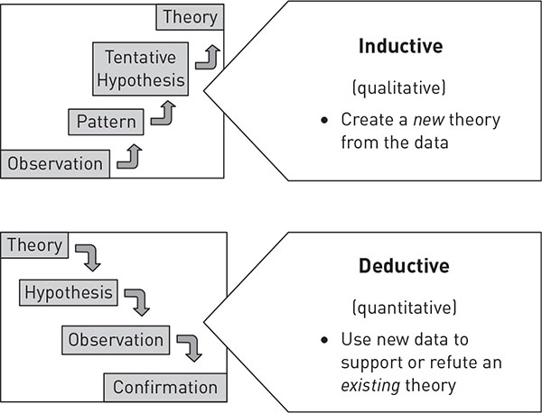

# Methodology {#sec-Chapter3}

```{r}
#| echo: false
#| output: false

options(scipen = 999)

# List of required packages
pkgs <- c(
  "data.table",
  "dplyr",
  "readr",
  "here",
  "purrr",  # for map functions
  "tibble", # for tibble functions
  "stringr",
  "ggplot2",
  "kableExtra"
  )

# Install missing packages
missing_pkgs <- pkgs[!sapply(pkgs, requireNamespace, quietly = TRUE)]
if (length(missing_pkgs) > 0)
  install.packages(missing_pkgs)

# Load all packages
invisible(lapply(pkgs, library, character.only = TRUE))

pkgs <- c(
  "DESeq2",
  "agilp",
  "limma",
  "GEOquery",
  "sva"
  )

# Install missing packages
missing_pkgs <- pkgs[!sapply(pkgs, requireNamespace, quietly = TRUE)]
if (length(missing_pkgs) > 0)
  BiocManager::install(missing_pkgs)

# Load all packages
invisible(lapply(pkgs, library, character.only = TRUE))
```

Write something here >> @hoffmann_cryo_2008

## Conceptual Framework

{#fig-conceptf width="15cm"}

## Data Collection Procedure
Write something here >>

### Inclusion Criteria
Write something here >>

### Exclusion Criteria
Write something here >>

## Data Processing and Analysis
Write something here >>

## Study Limitations

Write something here >>

## Ethical Considerations

Write something here >>